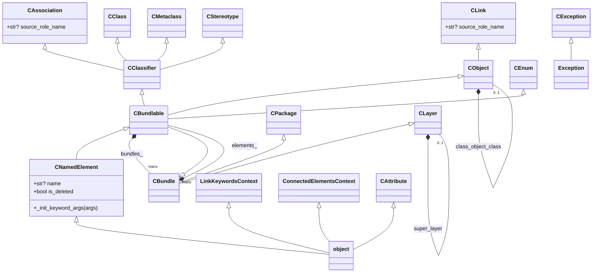

# Class Overview

```mermaid
classDiagram

class CAssociation {
    +str? source_role_name
}
CAssociation <|-- CClassifier

class CClass
CClass <|-- CClassifier

class CMetaclass
CMetaclass <|-- CClassifier

class CStereotype
CStereotype <|-- CClassifier

class CLink {
    +str? source_role_name
}
CLink <|-- CObject

class CClassifier
CClassifier <|-- CBundlable

class CBundle
CBundle <|-- CBundlable
CBundle "many" *-- CBundlable : elements_

class CPackage
CPackage <|-- CBundle

class CLayer
CLayer <|-- CBundle
CLayer *-- "0..1" CLayer : sub_layer
CLayer *-- "0..1" CLayer : super_layer

class CObject
CObject <|-- CBundlable
CObject *-- "0..1" CObject : class_object_class

class CEnum
CEnum <|-- CBundlable

class CBundlable
CBundlable <|-- CNamedElement
CBundlable *-- "many" CBundle : bundles_

class CNamedElement {
    +str? name
    +bool is_deleted
    +_init_keyword_args(args)
}
CNamedElement <|-- object

class LinkKeywordsContext
LinkKeywordsContext <|-- object

class ConnectedElementsContext
ConnectedElementsContext <|-- object

class CAttribute
CAttribute <|-- object

class CException
CException <|-- Exception
```